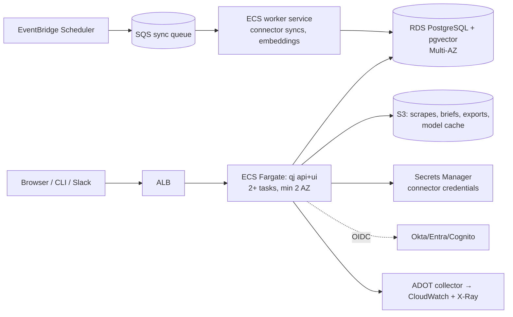

# QuickJoiner — Cloud Architecture Wishlist & 5-Year Evolution

Author: AWS architecture. 2026-07-11.
Prime directive: **the laptop is forever a first-class deployment.** Cloud is an amplifier
of the same wheel (`DATABASE_URL` switches backends; parity is CI-enforced), never a fork.

## Year 0 — today (shipped)

Local: SQLite + LanceDB + FTS5, fastembed, optional Ollama — zero infra, air-gap capable.
Container: single Docker image (UI baked in, `/data` volume). Team-ish: `docker-compose.cloud.yml`
= app + Postgres/pgvector, all state in PG (catalog, vectors, tsvector sparse, graph).
This section exists so every later year is diffed against something real.

## Year 1 — "Team Server": one org, one VPC, boring and bulletproof

Target: 5–200 users/org, self-hosted by the customer's platform team or by us (single-tenant).

Workstreams (each is a PR-able epic):
1. **Split the sync path out of the request path**: `qj-worker` entrypoint consuming SQS;
   APScheduler → EventBridge Scheduler emitting per-source messages; idempotency via the
   existing hash-dedupe + a `sync_lock` row (skip if running). *Code change is small because
   ingest is already pipeline-shaped.*
2. **AuthN/Z**: OIDC login (Authorization Code + PKCE) mapped onto the existing local-auth
   user model; SCIM later (Y2). Local password mode remains for air-gap.
3. **Blob offload**: scrapes/briefs/exports/artifacts to S3 (presigned URLs); FASTEMBED
   model cache warmed from S3 at task start.
4. **Secrets**: connector `env:` indirection resolves from Secrets Manager when
   `QJ_SECRETS=aws`; zero code in connectors changes (resolution seam already exists).
5. **Observability**: OTel traces (request → retrieval → provider call → tokens), structured
   JSON logs, RED dashboards; the eval harness runs nightly against a canary workspace and
   feeds a CloudWatch metric (refusal accuracy) with an alarm. *Grounding as an SLO.*
6. **IaC + delivery**: Terraform modules (network/data/app), GitHub OIDC deploy role,
   blue/green on ECS; image scanning (ECR + Inspector).
7. **DR/backup**: PITR on RDS, S3 versioning, weekly restore drill in CI (restore → run
   grounding smoke suite against the restored copy — *backups that answer questions*).
8. **Knowledge scopes — the personal-layer union** (intake 2026-07-18; also PRD W9.3).
   **Urgency raised 2026-07-24 by the OneDrive/SharePoint connector** (`PRIORITIES.md` #2):
   it is per-user by construction — a delegated Microsoft 365 token reads exactly what that
   person can read, *including files shared privately with them* — but everything it learns
   lands in the one communal memory, so a private document becomes retrievable and citable
   for every user of the workspace. The connector warns about this at connect time, in its
   `test()` message and before every on-demand learn, but a warning is not a control. This
   workstream is what turns it into one.
   Today ingested knowledge is one communal memory (documented in CLAUDE.md's auth bullet) —
   right for single-user/open mode, wrong at 5–200 users: a user's `/learn` notes and private
   scrapes pollute the org graph (entities, edges, corroboration counts, autocomplete),
   wrong personal "facts" become citable org truth, and personal notes are readable by all.
   Model: **query-time row-level visibility over ONE store** (never per-user forks) — user U
   retrieves the union of {ownerless commons, owned-by-U, shared} sources; the scope key is
   the existing `documents.source_id → sources.owner/shared` chain, so no doc-schema change.
   Work: (a) native source-visibility predicate in `store.search` (LanceDB where / pgvector
   WHERE / FTS sidecar, both hybrid legs, over-fetch so the grounding gate can't be starved
   into false refusals); (b) graph reads filtered by evidence-doc visibility
   (`graph_neighbors`/`graph_path[_candidates]`/`graph_expand`, plan-06 `edge_corroboration`
   counts visible evidence only); (c) **ingest-time merge guard** — personal evidence may
   attach to org entities but must never *trigger* a merge of them (a wrong merge rewrites
   canonical ids globally — the one pollution filtering can't undo); (d) aliases, suggester,
   and gaps scoped the same way; (e) `/learn` gains ownership (owner=user, private by
   default, `--share` to teach the commons — the connector flags exactly); (f) **promotion
   flow**: personal → org via review, a metadata flip, not a copy — the onboarding flywheel;
   plus a discounted `personal-note` evidence class so personal-vs-org contradictions
   surface with both citations (invariant I2), never silently averaged. Open-mode/single-user
   behavior stays byte-identical (everything is commons). **Must land before multi-user GA**
   — retrofitting visibility onto a polluted graph is a cleanup migration.

SLOs: API P95 < 400 ms (non-LLM), chat first token < 3 s, sync lag < interval + 5 min,
99.9% availability. Cost envelope (100 users): ~2×Fargate 1vCPU + db.r6g.large Multi-AZ +
S3/ALB ≈ **$600–900/mo** ≈ $6–9/user/mo infra.

## Year 2 — Multi-tenant SaaS + private LLM path

Target: self-serve teams; hundreds of tenants; the compliance conversation starts winning.

- **Tenancy model**: Postgres **schema-per-tenant** on Aurora PostgreSQL Serverless v2
  (the portable-SQL base makes `search_path` isolation nearly free; the factory grows a
  tenant resolver). Tiering: pooled Aurora for standard; dedicated cluster for enterprise.
  Per-tenant KMS keys (S3 prefixes + column crypto for secrets); tenant delete = drop
  schema + prefix purge with certificate.
- **Ingestion at scale**: fan-out workers with per-tenant SQS FIFO groups (fairness),
  webhook receivers behind API Gateway → SQS (absorb bursts), DLQs + replay tooling.
- **Embedding service**: dedicated inference (fastembed/bge on CPU autoscaling; GPU
  g5/inferentia if we adopt larger embedders); batch endpoint for backfills; per-tenant
  model version pins (a re-embed is a *migration* with its own runbook: dual-write, eval
  gate, cutover — the calibration step from AI_ROADMAP #3 runs automatically).
- **LLM path**: provider abstraction gains **Amazon Bedrock (Claude)** alongside direct
  Anthropic API — VPC endpoints, zero-retention configuration, per-tenant model choice and
  token budgets/metering (this is also the billing meter).
- **Product infra**: audit-replay store (PRD W9.2) as append-only S3 + Athena; gap/refusal
  analytics on the same lake; usage-based billing events via EventBridge → metering.
- **Security ladder**: SOC 2 Type I → II this year (CloudTrail org trail, Config,
  GuardDuty, access reviews); pen test; signed images + SBOM (Sigstore).
- Cost target (NFR N14): ≤ $0.15/user/day infra at 1k-user tenant — Aurora ACU autoscaling
  and Fargate Spot for workers are the levers; LLM tokens metered, passed through.

## Year 3 — Scale & retrieval specialization

Trigger-based, not calendar-based — each has a measured tripwire:

- **Vector store graduation** (tripwire: >50M chunks pooled or P95 recall latency > 900 ms):
  evaluate in order — (1) partitioned pgvector + pgvectorscale, (2) **S3 Vectors** /
  OpenSearch serverless for cold tiers with pgvector hot tier, (3) dedicated engine
  (Weaviate/Qdrant on EKS) only if 1–2 fail. The StoreBackend protocol is the seam; the
  contract test suite (TEST_STRATEGY §3.4) is the acceptance gate.
- **Graph graduation** (tripwire: >10⁷ edges or 3-hop P95 > 200 ms): Neptune vs staying
  relational with recursive CTEs + edge partitioning. Bias: stay relational; the evidence
  join to documents is the valuable (and relational) part.
- **Streaming knowledge**: connector CDC where sources support it (webhooks everywhere,
  Kafka/MSK for firehose sources like git events at org scale); freshness SLO per source
  ("Jira changes answerable < 60 s").
- **Per-tenant retrieval tuning as a service**: SageMaker pipelines for embedding LoRA
  fine-tunes from tenant eval packs (AI_ROADMAP #9), champion/challenger with automatic
  rollback on eval regression; conformal-calibrated refusal gates per tenant (#14).
- **Eval farm**: nightly per-tenant grounding scorecards; drift alarms; a public
  trust page per tenant admin (refusal accuracy, citation validity, staleness histogram).

## Year 4 — Hybrid, sovereign, certified

The regulated-industry flagship (`MARKET_ASSESSMENT` §6.6):

- **Customer-VPC deployment** (our Terraform in their account) and **air-gapped appliance**:
  EKS Anywhere / plain compose on-prem, local models only (Ollama + local embedder), update
  channel via signed offline bundles. The Y0 laptop story, certified and supported.
- **Data residency**: region cells (EU, US, APAC) with no cross-cell control plane data;
  tenant pinning; per-cell keys.
- **Compliance**: SOC 2 Type II mature, ISO 27001, HIPAA-eligible configuration; FedRAMP
  Moderate *assessment begins* (sponsor-dependent); DPAs with zero-retention LLM guarantees
  or fully local inference.
- **Enterprise identity**: SCIM, group-based sharing (connector ACLs already model
  owner/shared — extend to groups), audit export to customer SIEM (OCSF format).
- **Cell-based reliability**: shuffle-sharded cells, 99.95% SLO for enterprise tier, chaos
  drills (kill a cell, prove tenant isolation of blast radius).

## Year 5 — The knowledge fabric

Where the category goes if we win:

- **Autonomous knowledge ops**: agents (our own ops tools, matured) that maintain the
  corpus — detect stale/contradictory evidence (AI_ROADMAP #11/#13), open gap
  remediations, re-tune retrieval, and file their own audit trail. Human-approved actions
  only; the confirmation grammar from `add_connector` becomes a platform primitive.
- **Federation**: org-to-org selective graph/doc sharing (partner onboarding: your vendor's
  public runbooks federate into your territory with provenance intact) — signed evidence
  envelopes, per-edge visibility.
- **Connector marketplace**: the Connector protocol (test/sync/tools/handle_event/modes) is
  already a clean SDK; publish it, review submissions, revenue-share. Breadth problem (we
  lose 13 vs 100) solved by ecosystem, not headcount.
- **Ragless at fleet scale**: provider prompt-cache economics per tenant (AI_ROADMAP
  #15/#16) managed like a CDN — the router's cost model becomes a first-class FinOps
  surface.
- **Green/cost SLOs**: tokens and GPU-seconds per answered question reported per tenant;
  procurement increasingly asks.

## Standing wishlist (unscheduled, revisit quarterly)

- Lambda SnapStart-style scale-to-zero single-tenant instances (weekend-quiet orgs).
- DuckDB analytics sidecar over the audit lake for instant tenant analytics.
- WebSocket upgrade path for chat (SSE is fine; revisit at Slack-scale concurrency).
- Read replicas for graph/search-heavy tenants; pgbouncer fleet.
- Multi-provider LLM failover with grounded-answer equivalence checks (never silently
  switch models mid-conversation without stamping it in the audit record).

## The one rule that survives all five years

Every box in every diagram must answer: *what happens to the honesty contract here?*
A cache that serves a stale grounded answer, a failover model with a different calibration,
a replica lagging past the freshness SLO — each is a grounding bug, not an infra detail.
The eval harness is the only component that is allowed to veto a deploy in every year of
this roadmap.
